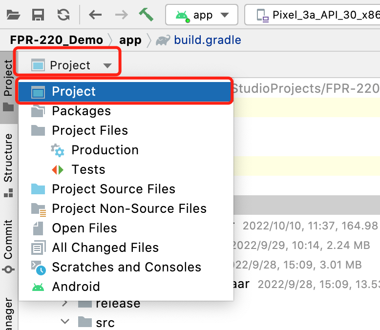
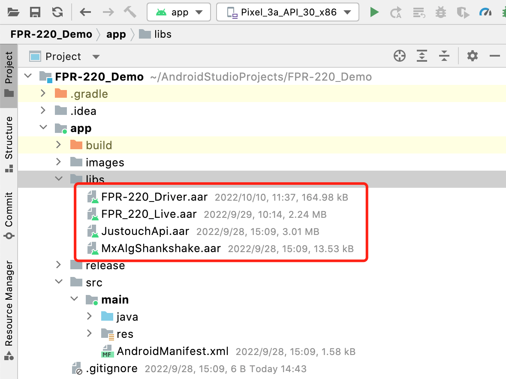

# FPR-220 Getting Startded Guide

[TOC]

## 1.Introduction

Welcome to use FPR-220 SDK. This document will introduce how to use FPR-220 SDK for development in Android.


## 2.SDK Contents

The SDK contains libraries and demo needed for the development of FPR-220,Contains the following directories:

- /apk or /bin

  The `apk` or `bin` folder contains the compiled binary files, which can be installed directly on the Android device.

- /demo 

  The `demo` folder is the source code corresponding to the apk file, which can be opened using Android Studio . 

> NOTE:
>
> The library (.so & .jar & .aar) file is included in the demo and is not provided separately.


## 3.Development Guide

### 3.1 Configure your project

This lesson shows you how to create a new Android project using Android Studio and introduces some of the files in the project.

To create a new Android project, follow these steps:

#### 3.1.1.  Create a new Android project

Create a new Empty Activity application project,You can refer to [Android Developer](https://developer.android.com/) to create an Android project.

#### 3.1.2. Enable Java 8

The SDK needs to work with **JDK 1.8**, open **build.gradle**, add a configuration inside, as shown in the figure:


#### 3.1.3. Add aar file

First, switch to the project view. Click on `Android` and select `Project`.As shown below:



Then, copy the aar from the demo project to the lib directory of your project, as shown below:



> NOTE:
>
> `JustouchApi.aar` is used for fingerprint algorithm.
>
> `FPR-220_Driver.aar` is used to access `FPR-220` Device.

#### 3.1.4. Congratulations

Congratulations, you have completed all the preparations, then you can refer to the **Sample Code** to learn how to use our API.

### 3.2 Sample Code

#### 3.2.1 FPR-220 Driver API

Get a instance of FPR-220 driver API :
```java
mxComFingerDriver mDriverApi = new mxComFingerDriver();
// do something with mDriverApi
```

Capture fingerprint image from FPR-220 device:

```java
byte[] image = new byte[256 * 360];
int imageResult = mDriverApi.mxGetFingerImageWithCompression(path, rate, 5000, image);
if (imageResult == 0) {
  // Capture successfully !
  MxImage mxImage = new MxImage(0, 256, 360, 1, image);
  // Convert raw image to Android bitmap
  byte[] imageDate = new byte[mxImage.width * mxImage.height + 1078];
  BmpLoader.Raw2Bmp(imageDate, mxImage.data, mxImage.width, mxImage.height);
  Bitmap bitmap = BitmapFactory.decodeByteArray(imageDate, 0, imageDate.length);
  //show bitmap
  ImageView imageView ;//The imageView to show fingerprint image
  imageView.setImageBitmap(bitmap);
} else {
  //process error code 
}
```

#### 3.2.2 Justouch Api

Create a instance of Jutouch Api :

```java
JustouchFingerAPI mJustouchApi = new JustouchFingerAPI();
```

Create FMR : 

```java
MxImage image ; // capture from FPR-220
byte[] fmrBuffer = new byte[1024];//Must be 1024 bytes
int result = mJustouchApi.createTemplateISO(image.data, image.width, image.height, fmrBuffer);
if (result >= 0) {
  // successfully
}
// If you use ISO2011, please call the following function :
// mJustouchApi.createTemplateISO2011(...)
// If you use ANSI, please call the following function :
// mJustouchApi.createTemplateANSI(...)
```

Match two FMR : 

```java
byte[] fmrBufferA //Must be 1024 bytes
byte[] fmrBufferB //Must be 1024 bytes
int similarScore = mJustouchApi.compareTemplatesANSI(fmrBufferA, fmrBufferB);
if (score >= 45) { // Suggest 45 pass
  // Match passed
} else if (score >= 0) {
  // Match not passed
} else {
  // Process error code 
}

```

> NOTE: 
>
> When Justouch works with FPR-220, there is no need to call initialization


## 4. Support Contact Information:

MIAXIS BIOMETRICS CO., LTD


**Official website:**

www.miaxis.net , www.miaxis.com

**Sales :**

amy@miaxis.com

**Technical Support :**

developer@miaxis.com

