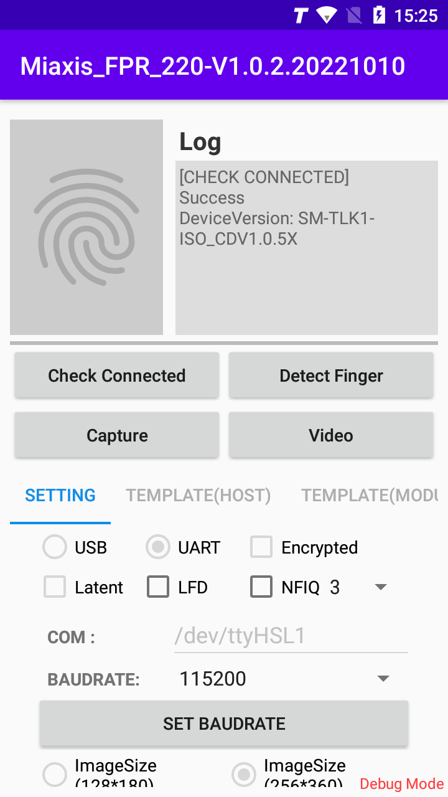
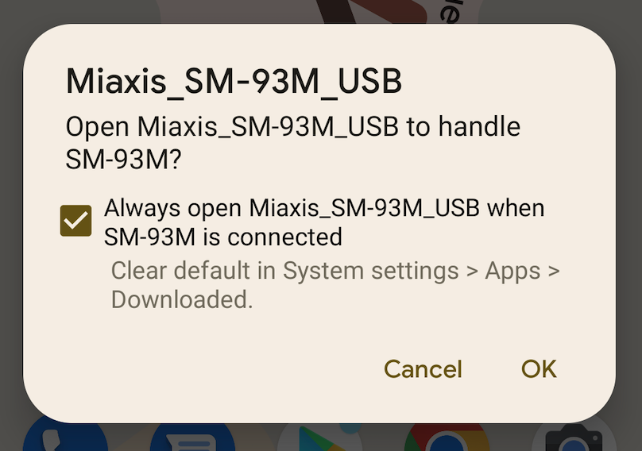
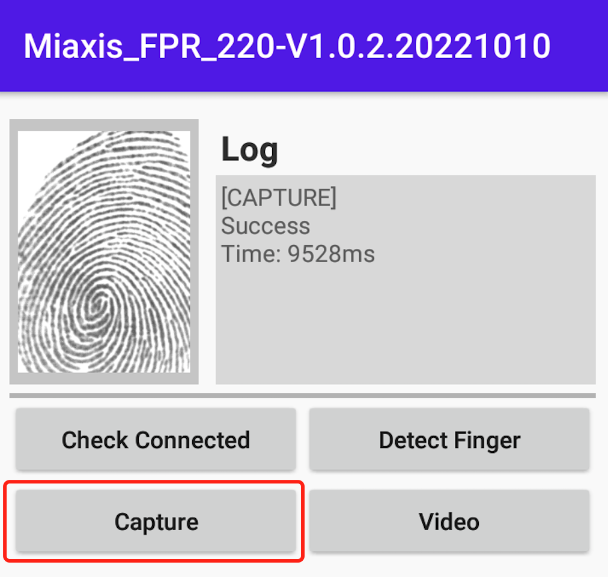

# How to Use SM-93M Demo

[TOC]

## Main View

## Capture 

### Open/Close Device

You must turn on the device before you can perform other operations. When you click **OPEN**, most Android OS will pop up a system prompt box, please click **OK**. As shown below:

After successfully turning on the device, all buttons will become active.

### Capture Setting

**Lantent : **

Checking `Lantent` indicates that you want to enable the lantent  fingerprint detection function, which can effectively suppress the influence of the residual fingerprints collected last time on this collection.

**LFD:**

Checking `LFD` indicates that you want to enable the live fingerprint detection function, which can reject the entry of fake fingerprints.

> NOTE:
>
> LFD and Lantent will affect all collections. Such as CAPTURE, ENROLL, VERIFY, SEARCH.

### Capture

Click `Capture`, the capture device will light up the red fill light. Then, place the user's finger on the collection surface of SM-93M. After the collection is complete, the log area will display the results. As shown below:

### DEVICE SN

Return SM-93M serial number

### SDK Version

Return SDK version

### NFIQ Check

The program will return the NFIQ score of the `current image`.

## Module

First select the fingerprint algorithm (ISO/ANSI), then enter the Template position (Template position range 0~999), and finally click on the function.

After completion, the log area will enter the results of this execution.

### ENROLL

Capture a fingerprint image, then extract features (FMR) from this image, and finally save this FMR in the module's template position flash.

### VERIFY

Capture a fingerprint image, then extract features (FMR) from this image, and finally use this FMR to compare the FMR of the  module's specified template position flash.

### SEARCH

Search the module's flash memory for the current finger print.

### REMOVE

Delete the specified template position in the module's flash memory.

### CLEAR

Empty the module's flash memory.

### UPLOAD

The program will export the fingerprint signatures flashed in the template position of the module to external storage in the fingerprint algorithm (ISO/ANSI) text of your choice.

### DOWNLOAD

The program will download the fingerprint algorithm (ISO/ANSI) text of your choice from external storage to the specified flash position of the module

## Host

First select the fingerprint algorithm (ISO/ANSI), then enter the user ID, and finally click on the function.

After completion, the log area will enter the results of this execution.

### ENROLL

Capture a fingerprint image, then extract features (FMR) from this image, and finally save this FMR in the database using the user ID.

### VERIFY

Capture a fingerprint image, then extract features (FMR) from this image, and finally use this FMR to compare the FMR of the specified user ID.

### SEARCH(IDENTIFY)

Use the entered id to search for fingerprints in the database.

### REMOVE

Delete the specified entry in the database.

### CLEAR

Empty the database.

### SHOW

Display the ID of all data in the database.

## Export

The program will export the `current image` to external storage.

### BMP

The program will export the `current image` as bmp to external storage.

### WSQ

The program will export the `current image` as wsq to external storage.

### JPEG2000

The program will export the `current image` as JPEG2000 image to external storage.

### Template

The program will export the `current image` as template to external storage.

> The `current image` refers to the image being displayed on the `ImageView` and will not be reacquired
>
> Default location :/sdcard/Android/data/com.miaxis.sm93m/files/